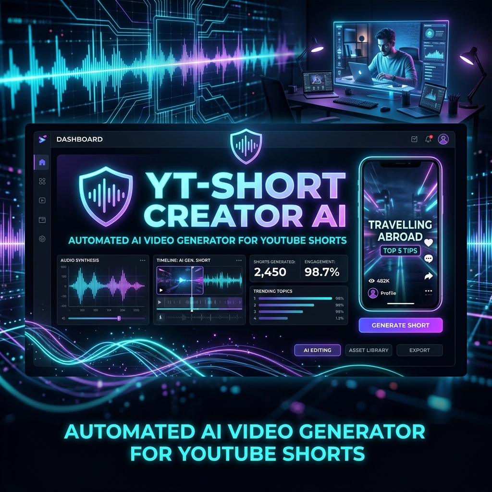

# 🎬 YT-SHORT CREATOR AI — Automated YouTube Shorts Production SaaS



An enterprise-grade, multi-tenant SaaS platform built for **100% automated YouTube Shorts production**. This platform leverages an asynchronous AI pipeline to research trending topics, write highly engaging scripts, generate cinematic voiceovers and images, stitch them into a dynamic video, and publish them to YouTube Studio using isolated Chrome profile sessions.

---

## 🚀 System Architecture & Execution Flow

Below is the end-to-end flow of the automated pipeline from the initial dashboard trigger to the final YouTube upload.

```mermaid
sequenceDiagram
    autonumber
    actor Creator as Content Creator
    participant Dashboard as Next.js Dashboard
    participant API as FastAPI Backend
    participant DB as Supabase DB & Storage
    participant AI as Generative AI Layer
    participant FFmpeg as FFmpeg Video Builder
    participant PW as Playwright Browser

    Creator->>Dashboard: Trigger Pipeline Run
    Dashboard->>API: POST /api/pipeline/run
    activate API
    API-->>Dashboard: Return Job ID (200 OK)
    
    rect rgb(30, 30, 46)
        note right of API: Background Task Execution
        API->>DB: Insert Run Record (Status: running)
        API->>AI: Fetch Trending Tech/AI Topics (Google Trends / RSS)
        AI-->>API: Return Topic
        API->>AI: Generate Script & Image Prompts (Gemini 2.5 Flash)
        AI-->>API: Return JSON (Script + 6 Image Prompts)
        API->>AI: Synthesize Audio Voiceover (TTS Backend)
        AI-->>API: Return voiceover.mp3
        API->>AI: Generate 6 vertical images (Fal.ai / Replicate)
        AI-->>API: Return 6 vertical PNGs
    end

    rect rgb(46, 30, 46)
        note right of API: Video Assembly
        API->>FFmpeg: Apply Ken Burns Zoom Effect
        API->>FFmpeg: Map timing and generate ASS Subtitles
        API->>FFmpeg: Burn subtitles & merge Audio + Video
        FFmpeg-->>API: Return final_short.mp4
    end

    rect rgb(30, 46, 30)
        note right of API: Storage & Publishing
        API->>DB: Upload final_short.mp4 to Supabase Storage
        API->>DB: Update Video Job Status (Status: completed + video_url)
        API->>PW: Launch Isolated Chrome Session (Playwright)
        PW->>PW: Navigate to YouTube Studio
        PW->>PW: Fill Title, Desc, Tags & Publish Video
        PW-->>API: Upload Complete
    end

    API->>Dashboard: Broadcast Log: "Process complete! Video ready."
    deactivate API
    Dashboard-->>Creator: Download Link & Live Dashboard View
```



---

## ✨ Key Features & Autonomous Agents

Our agentic pipeline is split into distinct, specialized modules that coordinate to produce high-retention content:

| Agent / Module | Icon | Technology Used | How it Works (Under the Hood) |
| :--- | :--- | :--- | :--- |
| **🔍 Researcher** | `researcher.py` | `pytrends`, `feedparser` | Scrapes Google Trends real-time queries for AI/Tech subjects. If blocked, falls back to parsing tech news RSS feeds (TechCrunch, Wired, The Verge) and filters for high-virality headlines. |
| **✍️ Scripter** | `scripter.py` | `google-genai` (Gemini) | Feeds the topic into Gemini (e.g. Gemini 2.5 Flash) with strict JSON formatting. Generates an energetic script, matching vertical image prompts (in English for generation quality), a viral title, description, and SEO tags. |
| **🗣️ Voicer** | `voicer.py` | `edge-tts`, ElevenLabs, Kokoro, Chatterbox | Converts the script text into a high-quality voiceover file (`.mp3`). Supports free Edge-TTS voices, high-end ElevenLabs synthesis, or a local cloned voice model using local **Chatterbox TTS** with automated VRAM allocation. |
| **🖼️ Visuals Gen** | `image_gen.py` | Fal.ai, Replicate, Pollinations | Asynchronously generates 9:16 vertical images (1080x1920) based on Gemini's visual prompts. It dispatches API requests in parallel to cloud GPUs running FLUX or Stable Diffusion XL. |
| **🎬 Video Builder** | `video_builder.py` | FFmpeg CLI Subprocesses | Determines audio length, splits image durations, applies a **Ken Burns zoom effect** using FFmpeg’s `zoompan` filter, creates timed word-by-word SubStation Alpha (`.ass`) subtitles, and burns them onto the final MP4. |
| **🚀 Studio Publisher** | `uploader.py` | Playwright Chromium | Launches a persistent Chrome session. Bypasses Google Sign-In blocks by using local pre-authenticated Chrome user profiles. Navigates YouTube Studio to upload the video, write metadata, and publish. |

---

## 🛠️ SaaS Tech Stack

The system is separated into highly modular layers to maintain isolation and allow concurrent video processing:

| Layer | Technology | Function / Purpose |
| :--- | :--- | :--- |
| **Frontend** | React, Next.js, TailwindCSS | Modern dark-mode dashboard featuring real-time WebSockets logs terminal, progress track nodes, and user profile configuration options. |
| **Backend** | FastAPI, Asyncio, Python 3.10+ | Asynchronous event loop server handling multi-tenant tasks, WebSocket broadcasting, and pipeline execution. |
| **Database & Auth** | Supabase (PostgreSQL) | Manages secure tenant login, database storage of user parameters, and job tracking records. |
| **Cloud Storage** | Supabase Storage | Hosts final rendered `.mp4` shorts in isolated user storage folders. |

---

## 🔐 Multi-Tenant Settings & Database Schema

When a user registers on the SaaS dashboard, they are assigned a unique `user_id`. The backend `ConfigManager` loads settings dynamically at runtime:
1. Loads a secure `DEFAULT_CONFIG` template.
2. Queries the user settings overrides from the `user_settings` Supabase table.
3. Injects user-specific settings (such as API keys and Chrome profile paths) into the active `PipelineRunner`.

This allows User A to generate videos using ElevenLabs with their private API key, while User B uses local Chatterbox voiceovers concurrently.

### 📋 Table Configurations

#### 1. `video_jobs`
Logs every execution instance and tracks run details:
*   `id` (UUID, Primary Key): Unique job identifier.
*   `user_id` (UUID, Foreign Key): Links to Supabase authentication user.
*   `status` (text): Tracks state (`running`, `completed`, `failed`).
*   `topic` (text): The topic brainstormed or manually chosen.
*   `video_url` (text): Public Supabase Storage download link.
*   `created_at` (timestamp): Date of execution.

#### 2. `user_settings`
Saves credentials encrypted and isolates configurations:
*   `user_id` (UUID, Primary Key): Links to the user account.
*   `api_keys` (JSONB): Stores user-specific API keys (`gemini`, `elevenlabs`, `fal_ai`, etc.).
*   `tts` (JSONB): Configured speech settings (voice IDs, edge-tts preferences).
*   `image` (JSONB): Image generation configuration (backend type, image counts).
*   `pipeline` (JSONB): Workflow settings (language, active Chrome upload profile, output folders).

---

## 📂 Project Structure

```text
SaaS_Project/
├── backend/
│   ├── main.py                 # FastAPI server & WebSocket Log Broadcaster
│   ├── config.py               # Global settings, output paths, and log configurations
│   ├── core/                   
│   │   ├── config_manager.py   # Multi-tenant configuration sync engine (Supabase)
│   │   └── utils.py            # Isolated helper utilities
│   ├── modules/
│   │   ├── pipeline_runner.py  # Asynchronous background orchestrator
│   │   ├── researcher.py       # Trending tech scraper (Google Trends API / RSS)
│   │   ├── scripter.py         # Gemini 2.5 Flash API script generator
│   │   ├── voicer.py           # Audio synthesis (ElevenLabs/Edge-TTS/Kokoro)
│   │   ├── image_gen.py        # Vision matrix generator (Fal.ai/Replicate/Pollinations)
│   │   ├── video_builder.py    # Subprocess-based FFmpeg compiling engine
│   │   └── uploader.py         # Playwright browser automation for YouTube Studio
│   └── backends/               # Sub-integrations for Image and TTS generation
├── frontend/                   # React/Next.js UI SaaS Dashboard
└── assets/                     # Media files for documentation (e.g. banner.png)
```

---

## ⚙️ Installation & Local Setup

### 1. Prerequisites
*   **Python 3.10+**
*   **Node.js 18+**
*   **FFmpeg** installed and added to the system environment path.
*   **Supabase Project** (Database URL and Service Role Key).

### 2. Backend Setup
```bash
cd backend
python -m venv venv

# Activate virtual environment
source venv/bin/activate  # On Linux/Mac
venv\Scripts\activate     # On Windows

# Install backend dependencies
pip install -r requirements.txt

# Install Playwright browser libraries
playwright install chromium
```

Create a `.env` file inside the `backend/` directory:
```env
SUPABASE_URL=https://your_project.supabase.co
SUPABASE_SERVICE_ROLE_KEY=your_supabase_service_role_key
```

### 3. Frontend Setup
```bash
cd frontend
npm install
```

### 4. Running the Project

**Start Backend (FastAPI):**
```bash
cd backend
python main.py
```
*The API is hosted on `http://127.0.0.1:8000`*

**Start Frontend (Next.js):**
```bash
cd frontend
npm run dev
```
*The Dashboard is hosted on `http://localhost:3000`*

---

## ⚠️ Notes on Deployment & Scalability

*   **Chrome Profiles Storage:** The uploader automation requires disk space to save Chrome browser user directories (e.g., `D:/ChromeProfiles`). Ensure your hosting provider has persistent storage so users do not have to re-authenticate on every run.
*   **FFmpeg Resource Usage:** Video compiling consumes heavy CPU and memory. Ensure the hosting virtual machine (VM) has adequate core density to accommodate multiple concurrent FFmpeg runs.
*   **Local High-Compute Tunnels:** If hosting the FastAPI backend in the cloud but running local GPU setups for Chatterbox TTS or ComfyUI, configure secure networking tunnels (e.g., Ngrok or Cloudflare Tunnels) to bridge cloud API commands with local hardware processing layers.

---

## ⚡ Technical Highlights (For Interviews)

*   **Ken Burns Zoom Effect**: Static slideshow transitions are replaced by dynamic, moving layouts. Images are scaled to twice their width/height and then slowly cropped in on a moving focal point using FFmpeg's `zoompan` math filters.
*   **Playwright Session Recovery**: Utilizing pre-authenticated browser directories allows Playwright to preserve login cookies and avoid Google's automated login blocks, eliminating the need for daily SMS/OTP requests.
*   **Log Interception Handler**: Standard print calls are routed to a custom python log handler that feeds an in-memory queue. This queue is broadcasted live to the dashboard over WebSockets, streaming real-time status details to the client's screen.
*   **10x Compiling Speeds**: Migrated from python editing libraries (like MoviePy) to direct FFmpeg process streams, reducing a 60-second video compile time from 5 minutes down to just 30 seconds.
