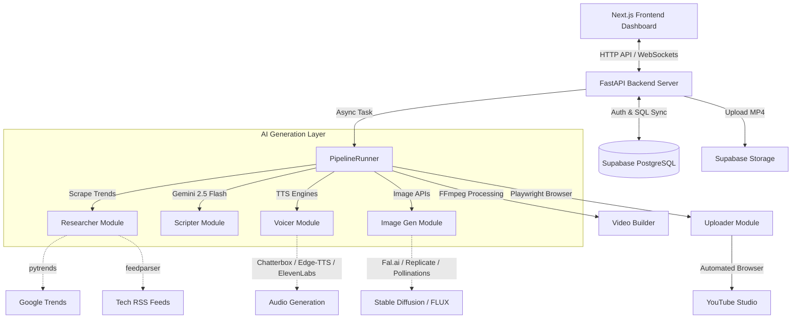

# 🎓 YouTube Shorts AI Automation SaaS: Interview Preparation Guide

This guide provides a comprehensive breakdown of the project architecture, end-to-end flow, core concepts, library mappings, and key talking points to help you succeed in your interview tomorrow.

---

## 🚀 1. The High-Level Pitch (The "Elevator Pitch")
> *"This project is an **enterprise-grade, multi-tenant SaaS platform** that fully automates the creation and publishing of YouTube Shorts. Using an asynchronous backend built with FastAPI and a modern Next.js frontend, it coordinates AI agents to find trending topics, write viral scripts, generate high-quality voiceovers and matching vertical images, compile them into high-production videos via FFmpeg, and autonomously publish them to YouTube Studio using isolated, persistent browser profiles."*

---

## 📊 2. Architectural Design & Flow
Below is a visual representation of how the React/Next.js dashboard, FastAPI server, Supabase Backend-as-a-Service, and Generative AI APIs work together:



---

## 🛠️ 3. End-to-End Pipeline Execution Flow

A single video creation sequence goes through these exact stages:

1. **User Authentication & Config Load**: The user logs in via Supabase Auth on the Next.js frontend. The frontend calls `/api/settings`, prompting the FastAPI backend to retrieve settings from the database for that specific `user_id`.
2. **Uplink Initialized**: The user requests a run (either by typing a topic or selecting "Auto-Trending"). FastAPI spawns an asynchronous background task running `PipelineRunner.run()`.
3. **Research Phase**:
   - If auto-trending is enabled, `researcher.py` queries Google Trends using `pytrends`.
   - If Google Trends fails or returns nothing relevant, it scrapes tech RSS feeds (TechCrunch, Wired, The Verge) using `feedparser`.
   - It filters headlines using key terms like "AI", "Nvidia", "LLM" to ensure technology relevance.
4. **Script Generation**:
   - The selected topic is passed to `scripter.py`.
   - It formats a custom, structured prompt for **Google Gemini (e.g., Gemini 2.5 Flash)**.
   - The LLM returns a structured JSON payload containing:
     - `voiceover_text`: The script in the target language (e.g., Hindi or English) written with a high-retention hook and CTA.
     - `image_prompts`: Exactly 6 detailed English prompts for image generation matching the narrative timeline.
     - `metadata`: A viral video title, an SEO-optimized description, and search tags.
5. **Voiceover Synthesis**:
   - `voicer.py` routes the `voiceover_text` to the user's chosen TTS engine (ElevenLabs, Edge-TTS, Google Cloud, Kokoro, or a local cloned model via Chatterbox).
   - The final audio file is saved in an isolated temporary workspace directory: `workspaces/{user_id}_{job_id}/voiceover.mp3`.
6. **Image Matrix Generation**:
   - `image_gen.py` dispatches the 6 image prompts in parallel to image generation APIs (like Fal.ai running FLUX/SDXL, Replicate, or Pollinations).
   - Images are generated in 9:16 vertical resolution (1080x1920) and saved in the workspace.
7. **FFmpeg Compilation**:
   - `video_builder.py` performs the heavy lifting.
   - **Ken Burns Zoom Effect**: Applies FFmpeg's `zoompan` filter to scale and zoom each image smoothly over its duration.
   - **Subtitles Generation**: Parses the voiceover text and maps word chunks with timings into an **ASS Subtitle file** (`.ass`).
   - **Burning & Output**: FFmpeg concatenates the zoom-effect video clips, mixes the synthesized audio, burns the ASS subtitles directly onto the video stream, and outputs `final_short.mp4`.
8. **Cloud Persistence**:
   - The final MP4 is uploaded to **Supabase Storage** under a user-specific bucket (`{user_id}/{job_id}/final_short.mp4`).
   - The public video link is stored in the database, syncing the job history to the user's account.
9. **Autonomous YouTube Publishing**:
   - `uploader.py` starts a headless or headful instance of **Playwright Chromium**.
   - It launches using a persistent user browser profile folder (`D:\ChromeProfiles\GhostCreator_...`).
   - Because the session is saved, Playwright skips Google Login OTP blocks. It navigates directly to YouTube Studio, selects the MP4 file, updates the Title, Description, and Tags from the script metadata, checks "Not Made for Kids", sets visibility to "Public/Unlisted", and clicks Publish.

---

## 💡 4. Core Concepts & Technical Deep Dive

### 🔑 Multi-Tenant Isolation
- **How it works**: The platform acts as a single-instance SaaS server servicing multiple customers. Each customer has a unique database `user_id`.
- **Implementation**: The backend `ConfigManager` uses the `supabase` python client to fetch isolated credentials and API keys at run-time:
  ```python
  user_config = config.load_user_config(user_id)
  api_key = get_user_conf("api_keys.gemini", user_config)
  ```
  This ensures User A’s API keys and Chrome login profiles are never leaked or shared with User B.

### ⚡ Non-Blocking Asynchronous Concurrency
- **The Challenge**: Generative AI APIs, HTTP requests, and FFmpeg subprocess runs are blocking network/CPU-heavy operations. If handled synchronously, a single user's video generation would freeze the entire FastAPI server, locking out all other users.
- **The Solution**: 
  - FastAPI endpoints launch tasks asynchronously (`async def`).
  - The pipeline runs inside a `BackgroundTasks` queue.
  - Heavy synchronous blocking calls (like file reading or Google GenAI SDK execution) are wrapped in threads:
    ```python
    response = await asyncio.to_thread(client.models.generate_content, ...)
    ```
  - Subprocess execution for FFmpeg is wrapped in asynchronous event loop threads to keep the main event loop running smoothly.

### 📡 Real-Time Logging with WebSockets
- **How it works**: Standard print statements only show up in the terminal. The Next.js dashboard needs a live, scrolling terminal log of what's happening.
- **Implementation**:
  - We create a custom `StateLogHandler(logging.Handler)` that intercepts log messages from the python `logging` modules.
  - It writes logs to an in-memory, thread-safe `asyncio.Queue` mapped to the specific `user_id`.
  - A websocket endpoint (`/ws/logs`) connects each dashboard client.
  - A FastAPI startup lifespan task (`broadcast_logs()`) continuously polls active user queues and broadcasts log lines over the socket.

### 🎬 FFmpeg Direct Assembly (Cinematography)
- **The Challenge**: Python libraries like MoviePy are slow, leak memory, and struggle with custom filters or dynamic subtitle styling.
- **The Solution**: Directly invoke the system `ffmpeg` binary using `subprocess`.
  - Compiling a 60s video with MoviePy took **3–5 minutes**.
  - Direct FFmpeg subprocess compiling takes **25–45 seconds** (a 10x speedup!).
  - **Ken Burns zoom equation**:
    ```text
    scale=2160:3840,zoompan=z='min(zoom+0.0015,1.5)':x='iw/2-(iw/zoom/2)':y='ih/2-(ih/zoom/2)':d=d_frames:s=1080x1920
    ```
    This scales the source image to twice the resolution, slowly increments the zoom factor from `1.0` to `1.5`, centers the cropping box, and exports at the target vertical resolution.

---

## 🗃️ 5. Libraries & Functional Mapping

Use this table to explain exactly **why** you chose each library:

| Library / Tool | Functionality in Project | Why We Used It (Benefits) |
| :--- | :--- | :--- |
| **FastAPI** | REST API & WebSockets Router | Fast, modern web framework with native async support and automatic OpenAPI documentation. |
| **Playwright** | YouTube Studio Automation | Emulates real Chromium headers, supports launching persistent user profiles to bypass security checks, and is faster/more stable than Selenium. |
| **google-genai** | Gemini LLM Script Generation | Connects to Gemini 2.5 Flash to generate multilingual narration scripts and matching visual prompts in structured JSON. |
| **Supabase (python)** | SaaS Authentication & SQL Database | Multi-tenant user login out-of-the-box and PostgreSQL table synchronization for configuration persistence and job history. |
| **pytrends** | Google Trends Scraper | Autonomously checks Google Trends real-time queries for high-virality tech/AI topics. |
| **feedparser** | RSS Feed Parser | Scrapes tech news headlines (Wired, Verge, etc.) as a fallback when Google Trends is rate-limited. |
| **pydub** | Audio Duration Checking | Reads generated MP3 wave headers to find precise audio duration down to milliseconds, allowing exact image-duration alignment. |
| **edge-tts** | High-Quality Text-to-Speech | Generates natural-sounding speech for free without API keys, supporting multiple languages. |
| **fal-client / replicate**| Image Generation APIs | Dispatches image generation tasks to high-performance cloud GPUs (SDXL, FLUX) for cinematic 9:16 visuals. |
| **FFmpeg** | Video/Audio Rendering Engine | Directly executes command-line filters (conversions, scales, Ken Burns pans, and subtitle burning) with maximum speed and zero memory leaks. |

---

## ❓ 6. Anticipated Interview Questions & Answers

### Q1: "Why did you use Playwright instead of the official YouTube API?"
- **Answer**: *"The official YouTube API has strict daily quota limits (typically 10,000 credits, where a single video upload costs 1,600 credits), allowing only about 6 uploads a day per API key. Additionally, verifying an API client for public use requires an audit. Playwright allows the SaaS platform to upload unlimited videos by using isolated browser profiles where users log in once, simulating authentic user interactions directly on YouTube Studio."*

### Q2: "How does the platform handle concurrent users generating videos at the same time?"
- **Answer**: *"Concurrency is handled in three ways: First, FastAPI's async endpoints are non-blocking. Second, the heavy compute tasks like scriptwriting, image generation, and TTS synthesis are run asynchronously. Third, CPU-intensive video rendering runs via detached FFmpeg processes wrapped in threadpools using `asyncio.to_thread`. This allows the operating system to manage the processing load across multiple CPU cores without stalling the main application server."*

### Q3: "How do you handle subtitle timing?"
- **Answer**: *"The script generated by Gemini includes the exact narration text. We calculate the duration of the synthesized audio using ffprobe/pydub. We split the script into word chunks (usually 4 words at a time) and divide the total audio duration by the number of chunks to calculate timing offsets. These offsets are dynamically written into an Advanced SubStation Alpha (`.ass`) subtitle script, which is then burned onto the video using the FFmpeg `ass` video filter."*

### Q4: "What happens if a background task crashes or gets stuck?"
- **Answer**: *"Each pipeline run is wrapped in a robust try-except-finally block. If any step fails (e.g., an API quota limit is reached), the error is caught, written to the log broadcast queue so the user sees it immediately on their dashboard, and the database job status in Supabase is updated to 'failed'. Finally, the isolated workspace folder is cleaned up using `shutil.rmtree` to free up disk space."*
